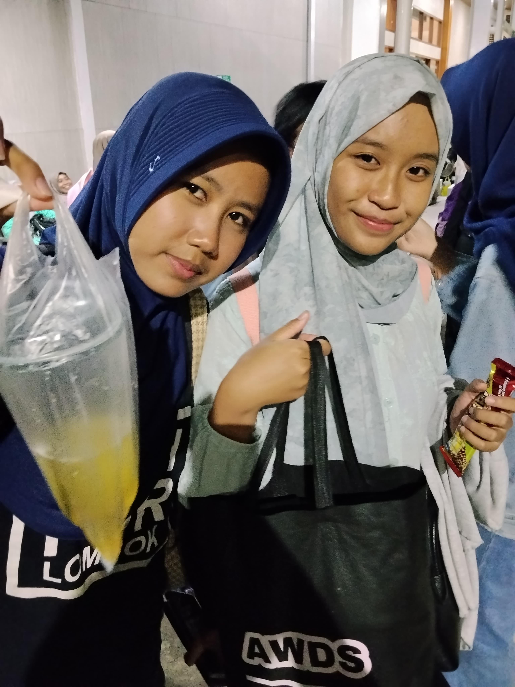

# 💌 A Letter For A Friend

Website surat digital interaktif untuk berterima kasih kepada sahabat. Dimulai dari amplop bersegel lilin, lalu terbuka menjadi surat, galeri polaroid, dan kartu apresiasi.

Dibuat dengan HTML, CSS, dan JavaScript biasa (tanpa framework, tanpa build).

## Isi halaman

1. **Amplop** – klik segel lilin (atau tombol "Click wax to open") untuk membuka
2. **Header + musik** – sapaan untuk sahabat dan pemutar Spotify
3. **A Letter For You** – surat dengan perangko dan cap pos
4. **Our Memories** – foto gaya polaroid
5. **Reasons Why You're Amazing** – kartu apresiasi
6. **Penutup** – "See you in our next chapter ♡"

## Struktur file

```
.
├── index.html   # struktur & isi teks
├── style.css    # tampilan, warna, font, responsif
├── script.js    # amplop, animasi scroll, nama
└── README.md
```

## Cara mengganti isi

| Yang diganti | Lokasi |
|---|---|
| Nama sahabat & nama kamu | `CONFIG` di bagian atas `script.js` |
| Isi surat, kartu alasan, pesan penutup | `index.html` (cari komentar `EDIT:`) |
| Foto & caption | `index.html`, bagian "Our Memories" (ganti `src` pada ``) |
| Lagu | `index.html`, `src` pada `<iframe>` Spotify |
| Warna | variabel di `:root` dalam `style.css` |
| Font | tag `<link>` Google Fonts di `index.html` dan `--font-*` di `style.css` |

### Mengganti lagu Spotify

Di Spotify: **Share → Copy link**. Ubah

```
https://open.spotify.com/track/ID_LAGU
```

menjadi

```
https://open.spotify.com/embed/track/ID_LAGU
```

lalu tempel ke `src` iframe.

### Memakai foto sendiri

Taruh foto di folder `images/`, lalu ubah `src`:

```html

```

## Menjalankan di lokal

Cukup buka `index.html` di browser. Atau pakai server lokal:

```bash
npx serve .
```

## Deploy ke Vercel

1. Push folder ini ke repository GitHub
2. Buka [vercel.com](https://vercel.com) → **Add New Project** → pilih repo
3. Framework Preset: **Other**, tanpa build command
4. Klik **Deploy**, lalu kirim link-nya ke sahabatmu

## Catatan

- Pemutar Spotify butuh internet, dan sebagian browser meminta klik dulu sebelum lagu bisa diputar
- Animasi dimatikan otomatis untuk pengguna yang mengaktifkan *reduced motion*
